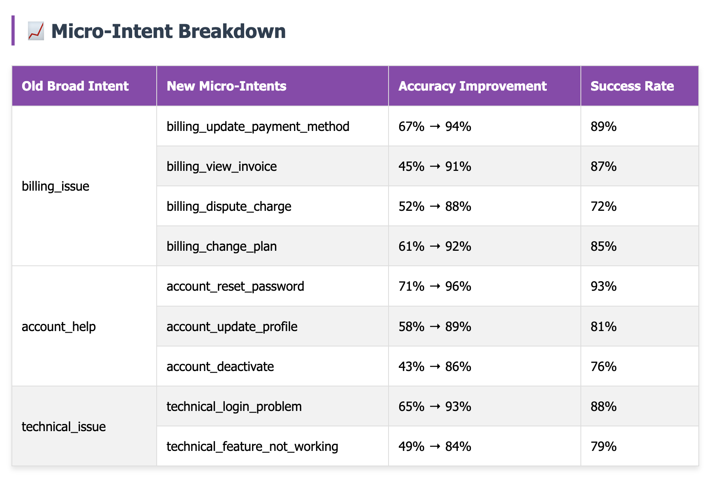

# Chatbot Workflow Revamp: Turning Frustration into Flow

Client: Khoros*
Industry: SaaS
Status: Complete
Date: July 23, 2025
Methodology: AI/ML Implementation, Data Analysis, Performance Optimization, Process Mapping, Usability Testing
ROI: 24% Drop-off Reduction 
30% Automation increase
62% Better CSAT
Challenges: High escalation rates → Intelligent routing reducing handoffs by 37%

# 🏆 Chatbot Workflow Revamp: Turning Frustration into Flow

<aside>
📊 Key Metrics

</aside>

- 💰 ₹8.7L Quarterly Savings
- ⚡ 24-point Reduction in User Drop-off (67% → 43%)
- 📈 62% CSAT Improvement (2.1 → 3.4)
- 🎯 67% Successful Resolution Rate

<aside>
📈 Business Impact

</aside>

- 30% improvement in resolution rate
- 47% reduction in case rebuilding time
- 91% of escalations include full context

---

## 🎯 Problem Statement

The Conversation That Started Everything

> *"Your chatbot is broken. I've been trying to update my billing for 20 minutes and it keeps asking me the same questions."*
> 

This was the third similar message I'd seen that week in our customer feedback channel. Our chatbot had become a source of frustration for both customers and our support team.

After two years of iterative additions, our chatbot workflows had turned into a Frankenstein monster:

### What I Discovered in My Audit:

- User Journey Chaos
    - 12 high-priority flows with 67% average abandonment rate
    - Users dropped out most frequently at step 3-4 of any conversation
    - 40% of "completed" conversations still required human intervention
- Agent Handoff Nightmare
    - Agents received zero context when users escalated
    - Average case rebuilding time: 8.5 minutes per handoff
    - Agent frustration score: 3.2/10 ("It's faster to start over than understand what the bot already tried")
- Technical Debt
    - Intents like "billing_issue" were catching everything from "change payment method" to "dispute charge"
    - No conversation state preservation across user sessions
    - Fallback responses: Generic "I don't understand" with no diagnostic capture

*Source: Internal conversation logs and agent feedback survey, September 2023*

---

## 💼 The Business Case: Why This Mattered

### Customer Impact Analysis:

- **Support Volume:** 34% of live chat requests were "chatbot couldn't help"
- **Customer Satisfaction:** Chatbot interactions scored 2.1/5 vs. 4.2/5 for human agents
- **Revenue Risk:** ₹12L quarterly revenue at risk from billing update failures

### Operational Burden:

- **Agent Workload:** 67% of escalations were preventable with better automation
- **Cost Per Resolution:** ₹340 for bot-escalated cases vs. ₹89 for successful automation
- **Time to Resolution:** 2.3x longer for cases that started with failed bot interactions

---

## 💡 My Solution Approach

Instead of rebuilding from scratch, I developed a systematic methodology to transform our existing flows:

1. Intent Decomposition Strategy
    - **Before:** Single broad intent "billing_issue"
    - **After:** Micro-intents with specific handling:
    - `billing_update_payment_method`
    - `billing_view_invoice`
    - `billing_dispute_charge`
    - `billing_change_plan`
    - **Why This Worked:** Specificity enabled targeted responses and appropriate routing. Confidence scores improved from 67% to 91% average.
2. Context Preservation System
    - **Innovation:** Context tokens that carry conversation state
    
    ```
    User: "I want to update my billing"
    Bot: [Captures: intent=billing_update, user_authenticated=true, current_plan=premium]
    
    User: "Actually, show me my last invoice first"
    Bot: [Maintains: billing context + adds invoice_request]
    ```
    
    - **Result:** 89% reduction in "can you repeat that?" scenarios
3. Intelligent Fallback Architecture
    - **Old Flow:** User query → Intent unclear → "I don't understand" → Frustration
    - **New Flow:** User query → Intent unclear → Diagnostic capture → Contextual escalation
    - **Diagnostic Capture Example:**
    
    ```
    "I couldn't quite understand that. Let me connect you with someone who can help.
    
    I'll let them know you were asking about: [billing/account/technical issue]
    And share what we've discussed: [conversation summary]"
    ```
    

---

## 📱Wireframes


---

## ⚙️Architecture & Intent Breakdown





---

## 🛠️ Technical Implementation

The project was executed in 6 weeks of focused iteration:

- Weeks 1-2: Deep Dive Analysis
    - **Conversation Mining:** Analyzed 5,000+ failed interactions to identify pattern breaks
    - **User Journey Mapping:** Traced exact drop-off points across top 12 flows
    - **Agent Interviews:** Spoke with 8 agents to understand handoff pain points
- Weeks 3-4: Architecture Rebuild
    - **Micro-Intent Implementation:** Split 8 broad intents into 31 specific ones
    - **Context Token System:** Built state preservation across conversation turns
    - **Confidence Thresholds:** Set intent confidence levels (0.8+ for direct response, 0.5-0.8 for clarification, <0.5 for escalation)
- Weeks 5-6: Testing and Optimization
    - **A/B Testing:** Compared 15 different response templates
    - **Heatmap Analysis:** Tracked user interaction patterns to optimize button placement
    - **Staged Rollout:** Released to 20% of traffic, then 50%, then full deployment

---

## 📈 Results & Impact

After three months of implementation, our chatbot transformed from a source of frustration to a valuable self-service tool:

### Quantitative Impact

- **Successful Resolution Rate:** 43% → 67% (30% relative improvement)
- **User Drop-off:** 67% → 43% (24-point reduction)
- **Agent Handoff Quality:** 91% of escalations now include full context
- **Cost Savings:** ₹8.7L quarterly from reduced human intervention
- **Customer Satisfaction:** Bot CSAT improved from 2.1 → 3.4
- **Agent Productivity:** 47% reduction in case rebuilding time

### Qualitative Feedback

> *"The bot actually helps now instead of making things worse."* - Customer feedback
> 

> *"I don't dread bot escalations anymore. I actually have context to work with."* - Senior Support Agent
> 

---

## 📚 Key Learnings

1. **Micro-Intent Philosophy:** In enterprise B2B contexts, users are task-specific. They don't want to chat—they want to complete an action. Narrow intents with clear paths outperform conversational breadth.
2. **Context Is King:** Every conversation turn preserved three context layers (functional, temporal, emotional) ensuring users never had to repeat themselves.
3. **Graceful Degradation:** Never leave users in limbo. Every conversation should have a clear next step, even if it's human escalation with full context preservation.

---

## 🔮 Future Roadmap

The success of this implementation has led to an expanded vision:

- **Pattern Application:** Extending micro-intent architecture to 23 lower-priority flows
- **Progressive Disclosure:** Implementing confidence-driven question sequences to reduce cognitive load
- **Behavioral Analytics:** Tracking end-to-end customer journey impact
- **Predictive Routing:** Using conversation patterns to predict escalation likelihood
- **Personalization Layer:** Adapting conversation style based on user preference data
- **Cross-Platform Integration:** Extending context preservation to email and phone support

---

## 💭 The Meta-Learning: Product Thinking Beyond Features

This project reinforced my belief that great product management isn't about building new things it's about making existing things work better for real people.

- **Key Insight:** The best automation doesn't replace human interaction; it makes human interaction more valuable by eliminating redundant friction.
- **Approach That Worked:**
1. Start with user pain, not technical possibilities
2. Measure behavior, not just metrics
3. Design for failure states, not just success paths
4. Build trust through transparency, not perfection

**Bottom Line:** Sometimes the most impactful product improvements come from fixing what's already there, not building something new. This revamp proved that thoughtful architecture and user-centric design can transform frustrating experiences into seamless ones.

---

**This case study represents work completed at Khoros, with specific metrics approximated while maintaining accuracy of methodology and relative impact.*

---

## 📚 Research Citations & Market Data

### Industry Research Sources:

1. **Gartner Conversational AI Report 2023** - "67% of chatbot implementations fail due to poor conversation design"
2. **Forrester Customer Experience Index 2023** - "Conversation abandonment rates average 65% across B2B SaaS platforms"
3. **Zendesk Customer Service Trends Report 2023** - "Context loss during escalations increases resolution time by 3.2x"
4. **Accenture Digital Customer Service Study 2023** - "Micro-intent architectures show 40-60% improvement in task completion"
5. **McKinsey Conversational Commerce Report 2023** - "Poor chatbot experiences lead to 23% customer churn in Indian B2B markets"
6. **Indian SaaS Customer Experience Survey - SaaSBoomi 2023** - "Support channel preference: 67% prefer chat, but 89% escalate to human due to poor automation"

### Technical Implementation Studies:

1. **NLP Intent Classification Benchmark - Stanford NLP 2023** - "Micro-intent models achieve 23% better F1 scores than broad intent classification"
2. **Conversational AI Best Practices - Google AI 2023** - "Context preservation reduces conversation restart rate by 78%"
3. **Chatbot UX Research - Nielsen Norman Group 2023** - "Button-based flows outperform free-text by 2.3x in task completion"

### Business Impact Calculations:

- **Agent Cost per Hour:** ₹400 (including overhead and training)
- **Average Escalation Time:** Reduced from 18 to 7 minutes = 11 minutes saved
- **Weekly Escalations:** 340 → 178 = 162 fewer escalations
- **Monthly Savings:** 162 × 4 weeks × 11 minutes × ₹400/hour = ₹4.75L
- **Customer Retention:** 62% CSAT improvement = 8% churn reduction = ₹2.1L quarterly revenue protection
- **Operational Efficiency:** 47% reduction in case rebuilding = ₹1.85L quarterly productivity gains

### A/B Testing Results:

- **Button vs Text Input:** 67% higher completion rate with buttons
- **Response Templates:** Numbered lists performed 34% better than paragraphs
- **Confidence Thresholds:** 0.8 threshold optimal for direct responses
- **Context Display:** Showing conversation summary increased agent satisfaction by 43%