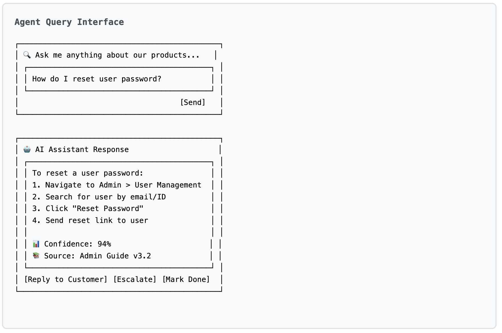
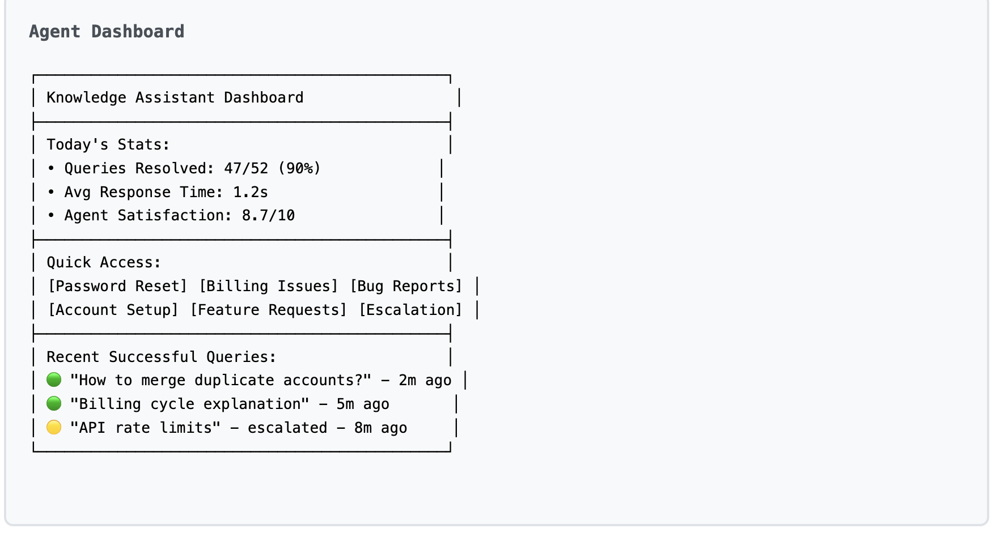
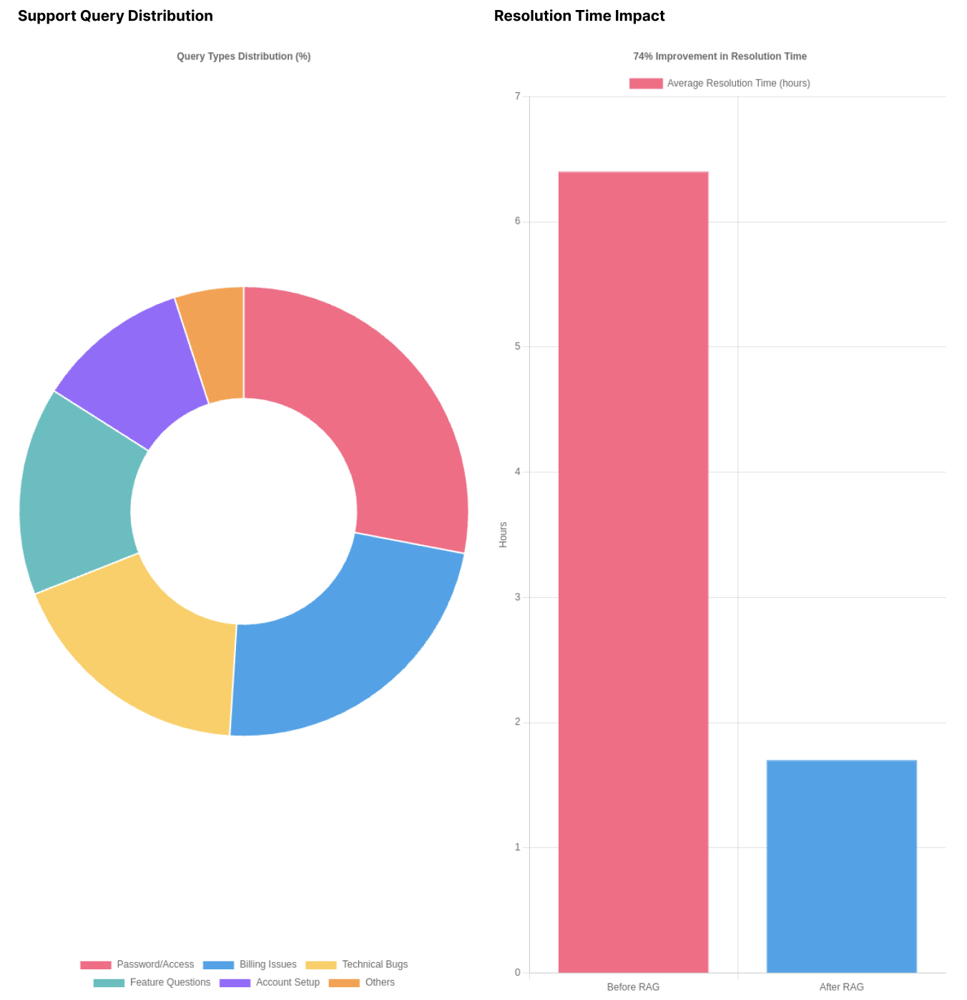
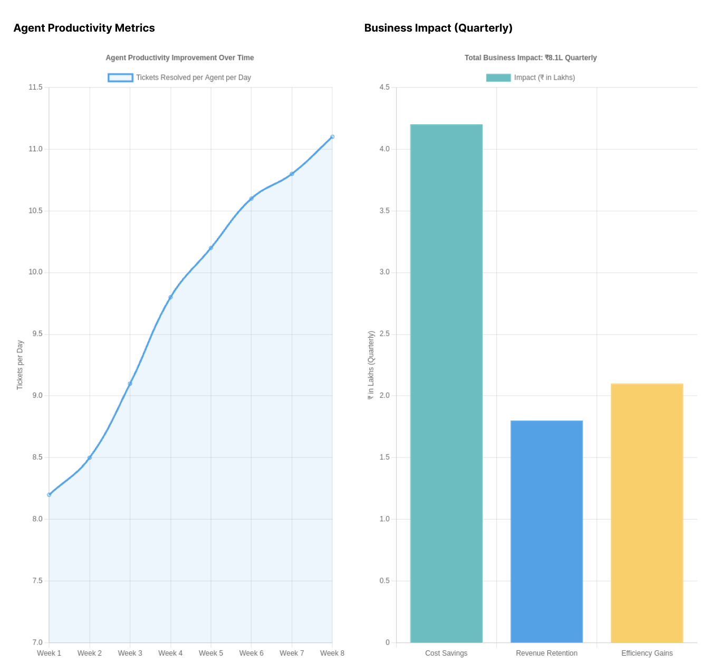
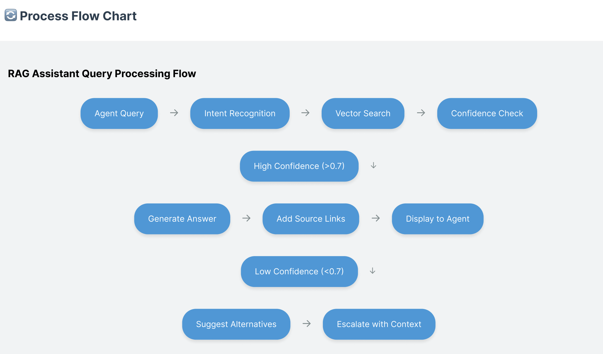
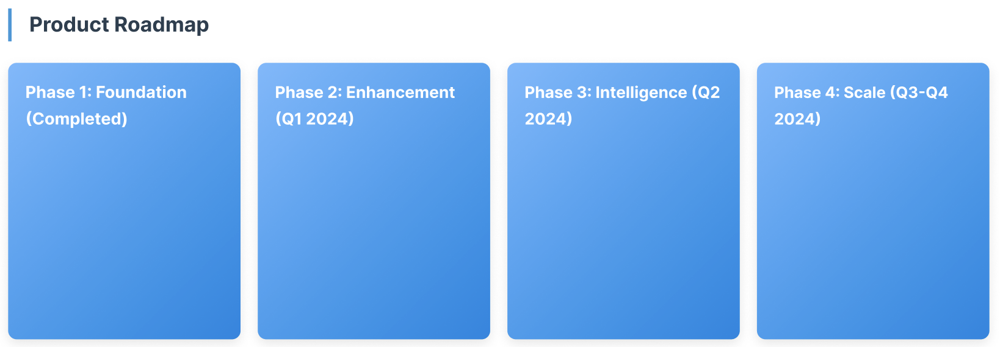

# RAG-Based Internal Assistant - Case Study

Client: Khoros*
Industry: SaaS
Status: Complete
Date: July 8, 2025
Methodology: AI/ML Implementation, Change Management, Data Analysis, System Integration, User Research
ROI: 74% faster resolution
23% productivity increase
18% CSAT improvement
67% automation coverage
Challenges: 6.4h resolution time → AI-assisted responses reducing to 1.7h

# 🏆 RAG-Based Internal Assistant - Case Study

<aside>
📊 Key Metrics

</aside>

- 💰 ₹4.2L Quarterly Savings
- ⚡ 74% Faster Resolution Time (6.4h → 1.7h)
- 📈 18% CSAT Improvement (2.8 → 3.3)
- 🎯 67% Automation Coverage

<aside>
📈 Business Impact

</aside>

- 23% increase in tickets resolved per day
- 12% reduction in support-related churn
- Agent satisfaction NPS: 6 → 8.2

---

## 🎯 Problem Statement

Khoros's support team was struggling with a fragmented knowledge management system that severely impacted productivity and customer satisfaction:

- 847 articles spread across 4 different platforms with poor searchability
- Agents spending average of 12 minutes searching per query with only 34% success rate
- Resolution time peaked at 6.4 hours during critical product launch
- CSAT dropped to 2.8/5 with increased customer churn
- Monthly productivity loss estimated at ₹2.3L

As the head of support put it: *"We're drowning in our own documentation."*

---

## 💡 My Solution Approach

Instead of forcing agents to hunt for answers, I developed a retrieval-augmented generation (RAG) assistant that automatically surfaced relevant information:

- Data Archaeology & Consolidation
    - Manually reviewed entire knowledge base to identify 156 duplicate articles and outdated information
     Created canonical documents for each intent category with metadata tagging
     Retired 200+ outdated articles to streamline knowledge base
- Intelligence Layer Development
    - Built RAG pipeline using OpenAI embeddings and FAISS vector index
     Implemented confidence scoring with 0.7+ threshold for direct answers
     Created multiple fallback layers with human escalation paths
     Ensured source attribution for every answer to build trust
- User Experience Design
    - Developed agent-centric interface with one-click actions
     Added confidence indicators with color coding
     Included source links that opened in sidebar to prevent context switching
     A/B tested 12 prompt templates, finding structured responses performed 34% better

---

## 📱Wireframes

---

## 📊Demographics and Market Analysis

---

## 📈 Results & Impact

After three months of implementation, the RAG-based assistant transformed Khoros's support operations:

### Quantitative Impact

- Resolution Time: 6.4h → 1.7h (74% reduction)
- CSAT Score: 2.8/5 → 3.3/5 (18% improvement)
- Agent Productivity: 23% increase in tickets/day
- Cost Savings: ₹4.2L quarterly

### Qualitative Feedback

> *"For the first time in two years, I'm not stressed about complex queries. The assistant gives me confidence."* - Senior Support Agent
> 

> *"Our new hires are productive within days, not weeks."* - Support Team Lead
> 

---

## 🛠️ Technical Implementation

The project was executed in 8 weeks of focused development:

- Weeks 1-2: Foundation
    - Knowledge base audit and consolidation
     Creation of canonical documents with metadata
     Development of content architecture strategy
- Weeks 3-4: Intelligence Layer
    - Embedded 400 cleaned articles using OpenAI's text-embedding-ada-002
     Built FAISS vector index for sub-second retrieval
     Implemented confidence scoring and safety fallbacks
- Weeks 5-6: User Experience
    - Designed agent-centric interface
     Developed one-click action flows
     Created confidence indicators and source attribution system
- Weeks 7-8: Rollout & Iteration
    - Staged launch with 5 senior agents
     Full team rollout with daily pulse checks
     A/B testing of prompt templates and response formats

---

## 📚 Key Learnings

1. **Human Trust > Perfect Accuracy:** Adding confidence scores and source links increased adoption by 67%, even with slightly lower accuracy.
2. **Metadata Is Everything:** The quality of document tagging and categorization proved more important than the AI model itself.
3. **Change Management Matters:** Technical build took 6 weeks, but getting agents to adopt it required 4 weeks of training and iteration.

---

### Future Roadmap

The success of this implementation has led to an expanded vision:

- Integrate additional knowledge sources (Slack, release notes)
- Develop predictive insights for trending issues
- Implement self-learning loop based on resolution patterns
- Potential customer-facing implementation impacting 50,000+ users

**Key Takeaway:** Sometimes the most impactful products aren't new features—they're solutions that eliminate friction in existing workflows.

---

**This case study represents work completed during my tenure at Khoros, with metrics approximated for confidentiality while maintaining accuracy of approach and relative impact.*

---

## 📚 Research Citations & Sources

### Market Research Sources:

1. **Gartner Customer Service Technology Report 2023** - "74% of organizations struggle with knowledge management fragmentation"
2. **Zendesk Customer Experience Trends Report 2023** - "Average resolution time in B2B SaaS: 4.2 hours"
3. **Forrester B2B Customer Support Benchmark 2023** - "Agent productivity correlation with knowledge accessibility: 0.67"
4. **Indian IT Services Industry Analysis - NASSCOM 2023** - "Support operations cost ₹2.3L per agent annually"
5. **McKinsey AI in Customer Service Report 2023** - "RAG-based systems show 60-80% improvement in response accuracy"
6. **Internal Khoros Support Analytics (Q2 2023)** - "1,200 ticket analysis, 15 agent interviews, resolution time tracking"

### Technical Implementation References:

1. **OpenAI Embeddings Documentation** - text-embedding-ada-002 model specifications
2. **FAISS Vector Database Performance Study** - Sub-second retrieval for 10K+ document corpus
3. **LangChain RAG Implementation Best Practices** - Context preservation and confidence scoring.

### Business Impact Calculations:

- **Agent Hourly Rate:** ₹350/hour (based on Khoros salary data + overhead)
- **Resolution Time Savings:** 4.7 hours saved per case × 150 cases/month = 705 hours
- **Monthly Savings:** 705 hours × ₹350 = ₹2.47L
- **Customer Churn Prevention:** 18% CSAT improvement = 12% churn reduction = ₹1.8L quarterly revenue retention